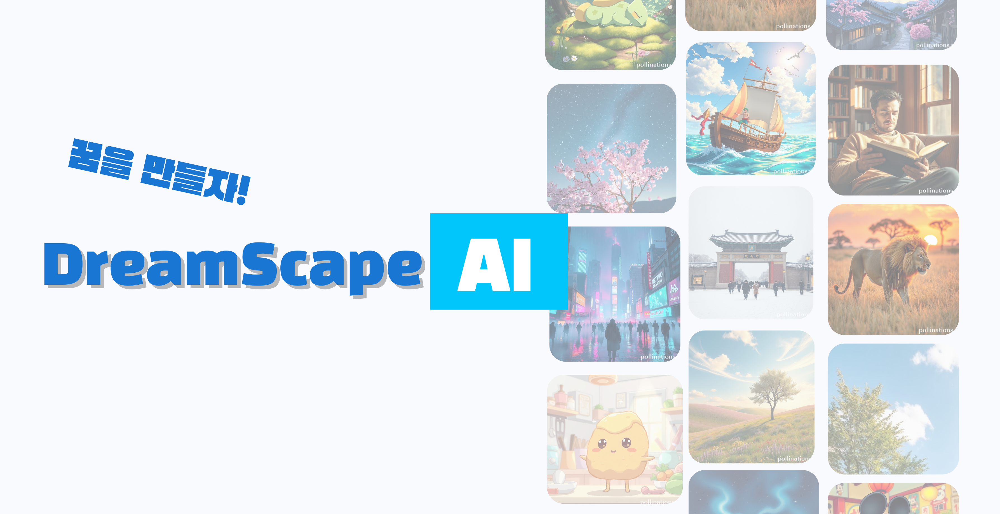

## 📌 소개

**DreamScapeAI**는 사용자가 AI를 활용하여 창의적인 이미지를 생성하고 공유할 수 있도록 돕는 플랫폼입니다. 사용자는 텍스트 기반의 프롬프트를 입력하여 원하는 이미지를 생성할 수 있으며, 생성된 이미지를 다운로드하거나 다른 사용자와 공유할 수 있습니다.

## 🚀 주요 기능

### 🖼️ 1. 이미지 업로드 및 게시물 구현

- ✅ 사용자는 이미지를 업로드하여 게시물을 만들 수 있습니다.
- ✅ 업로드한 이미지는 플랫폼에서 공유 가능하며, 댓글 및 소통 기능을 통해 사용자 간의 상호작용이 가능합니다.

### 🔄 2. 이미지 비율 조정 및 다운로드

- 📏 사용자는 생성된 이미지를 원하는 비율로 조정하여 다운로드할 수 있습니다.
- 📱 다양한 디바이스 및 플랫폼에 최적화된 이미지 크기로 변환이 가능합니다.

### 🎨 3. 프롬프트 입력 및 AI 이미지 생성

- 📝 사용자는 텍스트 기반의 프롬프트를 입력하여 AI가 이미지를 생성하도록 할 수 있습니다.
- 🎯 **DreamScapeAI**는 한 번에 최대 3개의 사물을 인식하여 이미지로 변환할 수 있습니다.

### 💡 4. 프롬프트 추천 기능

- 🔄 창의적인 아이디어가 떠오르지 않을 때, **프롬프트 추천** 버튼을 눌러 자동으로 생성된 프롬프트를 활용할 수 있습니다.
- 🎭 AI가 다양한 스타일과 테마를 고려하여 프롬프트를 제안합니다.

### 🔍 5. 실시간 검색 기능

- 🔎 사용자는 원하는 **프롬프트, 제목**을 입력하여 실시간으로 검색이 가능합니다.
- ⚡ 인기 검색어 기반의 자동 완성 기능을 제공하여 빠르고 직관적인 검색이 가능합니다.

### 💬 6. 댓글 및 소통 기능

- 🗨️ 생성된 게시물에 댓글을 달아 다른 사용자와 소통할 수 있습니다.
- 🤝 이미지에 대한 피드백을 주고받으며 창작 활동을 더욱 풍부하게 할 수 있습니다.

## 🛠️ 사용 방법

1. **📝 프롬프트 입력**: AI가 생성할 이미지의 내용을 설명하는 프롬프트를 입력합니다.
2. **🎨 이미지 생성**: 생성하기 버튼을 눌러 AI가 이미지를 생성하도록 합니다.
3. **📏 이미지 조정 및 다운로드**: 생성된 이미지를 원하는 비율로 조정하고 다운로드할 수 있습니다.
4. **📤 게시물 업로드**: 이미지를 게시하여 다른 사용자와 공유합니다.
5. **🔍 검색 및 탐색**: 키워드를 입력하여 원하는 이미지를 검색하고, 다양한 게시물을 탐색할 수 있습니다.
6. **💬 댓글 및 소통**: 게시물에 댓글을 달아 다른 사용자와 의견을 나눌 수 있습니다.

## 🛠️ 기술 스택

- **🖥️ 프론트엔드**: React, TypeScript, Styled Components
- **🔗 백엔드**: Firebase
- **🤖 AI 모델**: Stable Diffusion 기반 이미지 생성 AI, Gemini AI
- **💾 데이터베이스 및 스토리지**: Firebase Firestore

## 📅 개발 및 배포 계획

- **📌 1단계**: 기본 이미지 생성 및 업로드 기능 구현
- **📌 2단계**: 프롬프트 추천 및 실시간 검색 기능 추가
- **📌 3단계**: 댓글 및 소통 기능 강화
- **📌 4단계**: 사용자 경험 향상을 위한 UI/UX 개선 및 성능 최적화
- **📌 5단계**: Vercel 및 AWS 활용한 확장 가능 배포

## 💡 기여 방법

1. 프로젝트를 클론합니다.
   ```sh
   git clone https://github.com/your-repo/DreamScapeAI.git
   ```
2. 필요한 패키지를 설치합니다.
   ```sh
   npm install
   ```
3. 개발 서버를 실행합니다.
   ```sh
   npm start
   ```
4. 기능 추가 및 개선 후 PR을 생성합니다.

📢 **배포**: Vercel을 활용하여 배포되었습니다.
